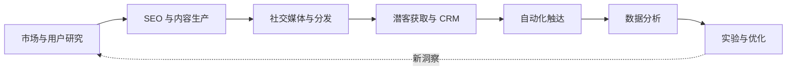

# 🚀 Nanako AI Marketing & Growth Map

**把 AI 真正用进市场研究、内容增长、获客、转化与实验。**

面向营销人、增长团队和 AI Builder 的精选开源项目地图。

[按场景找项目](#增长工作流) · [编辑精选](#编辑精选) · [Star 排行](#star-排行榜) · [完整数据](data/projects.csv) · [推荐项目](CONTRIBUTING.md)

---

## 这份合集解决什么问题？

很多“AI 营销工具榜”只是在堆链接：热门项目不一定适合营销，名字带 AI 的项目也不一定真的可用。

这个合集从**真实增长任务**出发，回答三个问题：

1. 它能替营销或增长团队完成什么工作？
2. 它是可以直接使用的产品，还是需要开发集成的基础设施？
3. 它真的值得尝试，还是只适合作为早期案例观察？

> [!IMPORTANT]
> **Star 是热度，不是效果。** 主列表按营销相关度、成熟度、维护活跃度和部署可行性综合排序；Star 榜只作为独立参考。

## 快速开始

| 你是谁 | 建议从这里开始 | 首选项目 |
|---|---|---|
| 🧑‍💼 营销 / 运营 | 内容、社媒、触达和用户反馈 | [Postiz](#3-社交媒体与内容分发)、[Mautic](#5-营销自动化与用户触达)、[Formbricks](#6-数据分析与增长实验) |
| 📈 增长 / 产品 | 漏斗、实验、CRM 和客户旅程 | [PostHog](#6-数据分析与增长实验)、[GrowthBook](#6-数据分析与增长实验)、[Twenty](#4-潜客获取对话与-crm) |
| 🧑‍💻 开发者 | 抓取、Agent 和自动化底座 | [Firecrawl](#1-市场竞品与用户研究)、[n8n](#5-营销自动化与用户触达)、[Flowise](#7-ai-增长-agent-与搭建工具) |
| 🌍 独立开发者 / 出海团队 | 研究、获客、分析与低成本自托管 | [GPT Researcher](#1-市场竞品与用户研究)、[Typebot](#4-潜客获取对话与-crm)、[Umami](#6-数据分析与增长实验) |

## 增长工作流

<strong>标签说明</strong>

- `AI 原生` — 核心工作由大模型或 Agent 完成。
- `AI 可接入` — 已有成熟业务能力，并提供 AI、API、MCP 或自动化接口。
- `增长基础设施` — 不一定主打 AI，但承担增长工作流中的关键环节。
- `推荐` — 相关度与成熟度较高，值得优先了解。
- `潜力` — 方向相关，但仍需观察稳定性或实际效果。
- `案例` — 适合学习产品思路，不代表适合直接用于生产环境。

## 编辑精选

不想看完整列表？可以先从这 12 个项目开始：

| 最适合的场景 | 项目 | 为什么值得看 |
|---|---|---|
| 市场与竞品研究 | [GPT Researcher](https://github.com/assafelovic/gpt-researcher) | 把多来源检索、整理和引用串成完整研究流程 |
| 竞品监控、批量研究 | [Firecrawl](https://github.com/firecrawl/firecrawl) | 为研究 Agent 提供网站抓取和结构化数据入口 |
| 社交媒体增长 | [Postiz](https://github.com/gitroomhq/postiz-app) | 从内容排期到多平台发布与分析的一体化方案 |
| 销售与客户管理 | [Twenty](https://github.com/twentyhq/twenty) | 活跃、现代、面向 AI 扩展的开源 CRM |
| 对话式获客与转化 | [Chatwoot](https://github.com/chatwoot/chatwoot) | 将多渠道客户对话、客服与售前转化放在一起 |
| 营销自动化 | [Mautic](https://github.com/mautic/mautic) | 成熟的用户分群、活动和线索培育平台 |
| AI 增长工作流 | [n8n](https://github.com/n8n-io/n8n) | 连接模型、CRM、表单、邮件和数据库的通用胶水 |
| 生命周期运营 | [Dittofeed](https://github.com/dittofeed/dittofeed) | 面向开发者的多渠道客户旅程与消息触达 |
| 产品增长 | [PostHog](https://github.com/PostHog/posthog) | 覆盖漏斗、留存、回放、实验和渠道分析 |
| A/B 测试 | [GrowthBook](https://github.com/growthbook/growthbook) | 完整的实验统计与 Feature Flag 能力 |
| 用户研究 | [Formbricks](https://github.com/formbricks/formbricks) | 用真实用户反馈校正 AI 推断和产品判断 |
| AI 应用搭建 | [Flowise](https://github.com/FlowiseAI/Flowise) | 用可视化方式搭建研究、内容和客服 Agent |

---

## 项目目录

### 1. 市场、竞品与用户研究

- **[GPT Researcher](https://github.com/assafelovic/gpt-researcher)**  — 搜索行业、市场和竞品资料，生成带来源的研究报告。`AI 原生` `中等门槛` `Apache-2.0`
- **[Firecrawl](https://github.com/firecrawl/firecrawl)**  — 将竞争对手网站和产品页转成适合 AI 分析的结构化数据。`AI 基础设施` `中高门槛` `AGPL-3.0 / 部分云能力`
- **[Crawl4AI](https://github.com/unclecode/crawl4ai)**  — 批量抓取网页并输出 LLM 友好的 Markdown 或结构化内容。`AI 基础设施` `中高门槛` `Apache-2.0 + 额外署名要求`

> [!CAUTION]
> 抓取公开网页也需要遵守网站条款、robots 规则、隐私要求和适用法律。AI 研究报告应保留来源，并由人核验关键结论。

### 2. SEO、GEO 与内容增长

- **[Trivium](https://github.com/KaiMOdev/trivium)**  — 用确定性规则检查技术 SEO、AI 搜索可读性和页面营销表达。`潜力` `AGPL-3.0`
- **[OpenSEO](https://github.com/Juliusolsson05/openSEO)**  — 生成关键词、文章结构和模块化 SEO 内容；项目仍处早期。`AI 原生` `潜力` `GPL-3.0`
- **[OmniSearch AI](https://github.com/hassanrrraza/omnisearch-ai)**  — 面向 SEO、AEO、GEO 和 LLM 搜索发现优化内容。`AI 原生` `潜力` `许可证待复核`

> [!NOTE]
> “为 GEO 优化”不代表一定会被 ChatGPT、Perplexity 或搜索引擎引用。真实证据、品牌权威性和人工编辑仍然是决定因素。

### 3. 社交媒体与内容分发

- **[Postiz](https://github.com/gitroomhq/postiz-app)**  — 多平台内容排期、发布、协作和效果分析，并提供 API 与自动化集成。`AI 可接入` `推荐` `AGPL-3.0`
- **[Mixpost](https://github.com/inovector/mixpost)**  — 自托管社交媒体排期与内容管理。`增长基础设施` `待评估` `MIT / Pro 版另行授权`
- **[Socioboard](https://github.com/socioboard/Socioboard-5.0)**  — 多账号发布、内容管理和社媒分析；主要发行和文档较旧。`历史案例` `许可证待复核`

### 4. 潜客获取、对话与 CRM

- **[Twenty](https://github.com/twentyhq/twenty)**  — 管理公司、联系人、线索、商机和销售流程。`AI 可接入` `推荐` `AGPL-3.0 / Enterprise`
- **[Chatwoot](https://github.com/chatwoot/chatwoot)**  — 统一处理网站聊天、邮件和社交渠道中的客户对话。`AI 可接入` `推荐` `MIT / Enterprise`
- **[Typebot](https://github.com/baptisteArno/typebot.io)**  — 构建对话式表单、线索收集、预约和资格判断流程。`AI 可接入` `推荐` `AGPL-3.0`
- **[OpenCRM](https://github.com/arkitekt-ai/OpenCRM)**  — 将线索、销售管道、邮件活动和 AI 文案放进一个自托管 CRM。`AI 原生` `案例` `许可证待复核`

> [!WARNING]
> CRM 不等于自动获客。群发、冷邮件、客户画像和线索评分需要遵守隐私、反垃圾邮件及平台规则。

### 5. 营销自动化与用户触达

- **[Mautic](https://github.com/mautic/mautic)**  — 用户分群、营销活动、线索培育和多渠道自动化。`增长基础设施` `推荐` `GPL-3.0`
- **[n8n](https://github.com/n8n-io/n8n)**  — 连接模型、表单、CRM、邮件与数据库，搭建多步骤增长工作流。`AI 可接入` `推荐` `Fair-code`
- **[Activepieces](https://github.com/activepieces/activepieces)**  — 用低代码方式搭建 AI Agent 和跨应用自动化。`AI 可接入` `推荐` `MIT 核心 / Enterprise`
- **[Dittofeed](https://github.com/dittofeed/dittofeed)**  — 通过邮件、短信、推送和 Webhook 构建事件驱动的用户旅程。`AI 可接入` `推荐` `MIT`
- **[listmonk](https://github.com/knadh/listmonk)**  — 高性能 Newsletter、订阅用户和批量邮件管理。`增长基础设施` `推荐` `AGPL-3.0`
- **[Novu](https://github.com/novuhq/novu)**  — 为产品和 Agent 提供邮件、短信、推送与聊天触达层。`AI 可接入` `推荐` `MIT 核心 / Enterprise`

> [!IMPORTANT]
> n8n 是 fair-code，不应简单称为传统意义上的完全开源项目。触达系统还需自行处理同意、退订、频率控制和送达率。

### 6. 数据分析与增长实验

- **[PostHog](https://github.com/PostHog/posthog)**  — 覆盖漏斗、留存、路径、回放、实验和渠道分析。`AI 可接入` `推荐` `MIT 核心 / Open core`
- **[GrowthBook](https://github.com/growthbook/growthbook)**  — A/B 测试、Feature Flag 和实验统计平台。`AI 可接入` `推荐` `MIT 核心 / Enterprise`
- **[Formbricks](https://github.com/formbricks/formbricks)**  — 通过站内、邮件和链接问卷收集真实用户反馈。`AI 可接入` `推荐` `AGPL-3.0`
- **[Plausible](https://github.com/plausible/analytics)**  — 隐私友好的网站流量和渠道分析。`增长基础设施` `推荐` `AGPL-3.0 社区版`
- **[Umami](https://github.com/umami-software/umami)**  — 轻量、隐私友好的网站分析。`增长基础设施` `推荐` `MIT`
- **[Metabase](https://github.com/metabase/metabase)**  — 连接数据库，构建增长看板和自助分析。`AI 可接入` `推荐` `AGPL 社区版 / Enterprise`

### 7. AI 增长 Agent 与搭建工具

- **[Langflow](https://github.com/langflow-ai/langflow)**  — 可视化搭建研究、内容和客服等 AI Agent。`AI 原生基础设施` `推荐` `MIT`
- **[Flowise](https://github.com/FlowiseAI/Flowise)**  — 可视化构建 Agent、RAG、聊天机器人和多步工作流。`AI 原生基础设施` `推荐` `Apache-2.0`
- **[LoopMark Agent](https://github.com/loopmark-opensource/loopmark-agent)**  — 将社交内容、邮件活动、线索漏斗和客户投诉交给专门 Agent。`AI 原生` `案例` `MIT`
- **[AdClaw](https://github.com/Citedy/adclaw)**  — 用多个专门 Agent 组织研究、SEO、广告和内容任务。`AI 原生` `观察` `许可证待复核`
- **[AI Marketing Skills](https://github.com/superamped/ai-marketing-skills)**  — 为编码 Agent 提供 SEO、文案、竞品和广告技能。`AI 原生` `观察` `许可证待复核`
- **[Growth Marketing Skills](https://github.com/duandigi/duandigi-growth-marketing-skill)**  — 多渠道营销分析、实验和需要人工批准的优化流程。`AI 原生` `案例` `MIT`

---

## Star 排行榜

截至 **2026-09-15** 的近似快照。项目正文中的徽章显示当前 Star；这里的数字只用于观察社区热度。

| # | 项目 | 快照 Star | 增长角色 |
|---:|---|---:|---|
| 1 | [n8n](https://github.com/n8n-io/n8n) | 204.3k | 通用 AI 与业务自动化 |
| 2 | [Langflow](https://github.com/langflow-ai/langflow) | 154.7k | 通用 AI Agent 搭建 |
| 3 | [Twenty](https://github.com/twentyhq/twenty) | 56.7k | CRM 与销售流程 |
| 4 | [Flowise](https://github.com/FlowiseAI/Flowise) | 55.1k | 通用 AI Agent 搭建 |
| 5 | [Crawl4AI](https://github.com/unclecode/crawl4ai) | 50k+ | 市场研究数据入口 |
| 6 | [Firecrawl](https://github.com/firecrawl/firecrawl) | 40.1k | 市场研究数据入口 |
| 7 | [Novu](https://github.com/novuhq/novu) | 40.0k | 多渠道消息基础设施 |
| 8 | [PostHog](https://github.com/PostHog/posthog) | 37.4k | 产品与增长分析 |
| 9 | [Chatwoot](https://github.com/chatwoot/chatwoot) | 36.8k | 客户对话与转化 |
| 10 | [Postiz](https://github.com/gitroomhq/postiz-app) | 35.8k | 社交媒体增长 |
| 11 | [GPT Researcher](https://github.com/assafelovic/gpt-researcher) | 29.4k | 市场与竞品研究 |
| 12 | [Activepieces](https://github.com/activepieces/activepieces) | 24.4k | AI 自动化 |
| 13 | [listmonk](https://github.com/knadh/listmonk) | 21k | 邮件触达 |
| 14 | [Formbricks](https://github.com/formbricks/formbricks) | 12.9k | 用户反馈与研究 |
| 15 | [Mautic](https://github.com/mautic/mautic) | 10.5k | 营销自动化 |
| 16 | [GrowthBook](https://github.com/growthbook/growthbook) | 8.3k | 增长实验 |
| 17 | [Dittofeed](https://github.com/dittofeed/dittofeed) | 2.9k | 用户旅程与触达 |

## 收录标准

本项目遵循 **“精选，而不是收集”** 的原则。候选项目至少应满足以下大部分条件：

- 与营销、获客、触达、转化、分析或增长实验存在直接关系。
- 有公开仓库、清晰 README 和可确认的许可证或授权说明。
- 可以运行、部署，或作为真实增长工作流的一部分使用。
- 近期仍在维护；不活跃但有代表性的项目只进入历史案例区。
- 明确区分开源、open core、fair-code 和商业产品配套仓库。
- 不把 Star 数、项目方宣传语或未经验证的增长效果当成推荐理由。

### 综合排序权重

`营销相关度 35%` · `成熟度 25%` · `维护活跃度 15%` · `部署可行性 10%` · `文档完整度 10%` · `Star 5%`

## 参与贡献

发现优秀项目、信息过期或分类不准确？欢迎阅读 [CONTRIBUTING.md](CONTRIBUTING.md)，然后提交 Issue 或 Pull Request。

推荐项目时请说明：增长场景、许可证、部署方式、必要的付费 API、已知限制，以及你是否与项目存在利益关系。

## 维护与更新

- Star 榜以带日期的快照发布，不伪装成永久实时排行。
- 项目正文使用动态 Star 徽章，方便快速观察当前热度。
- 许可证、维护状态和商业版边界需要定期复核。
- 失去维护、改变授权或出现重大安全问题的项目会被降级、移动或移除。

## 声明

- 本合集与所列项目没有默认商业合作关系。
- 自动抓取、群发、广告投放和社交媒体发布应遵守当地法律及平台规则。
- 收录只代表“值得研究”，不构成安全、合规或商业效果保证。

## License

列表内容采用 [CC0-1.0](https://creativecommons.org/publicdomain/zero/1.0/)。各项目代码继续适用其各自许可证。

**如果这份地图对你有帮助，欢迎 Star、分享或推荐一个真正值得收录的项目。**

[回到顶部](#top)

